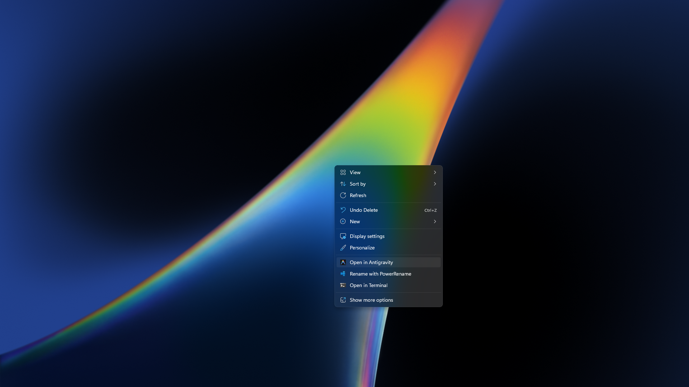

<h1>
  
  <span style="vertical-align: middle;">Open in Antigravity</span>
</h1>

Add a seamless "Open in Antigravity" context menu entry to Windows. Integrates with both Windows 11 Modern and Classic (Legacy) context menus.

Demo Screenshot:



## Installation

### Option 1 (Recommended):
Run in an elevated PowerShell window:
```powershell
irm https://raw.githubusercontent.com/TheTahsinShahriar/Open-in-Antigravity/main/assets/setup.ps1 | iex
```

### Option 2: Manual Installation
1. **[Download](https://github.com/TheTahsinShahriar/Open-in-Antigravity/archive/refs/heads/main.zip)** and extract this repository.
2. Double-click **`run-setup.bat`** and follow the prompts.

---

## Requirements

- **Antigravity IDE**: Must be installed at:  
  `%LocalAppData%\Programs\Antigravity IDE\Antigravity IDE.exe`
- **Custom Context Menu App** (Required only for the Windows 11 Modern Menu):  
  Download it for free on the [Microsoft Store](https://apps.microsoft.com/detail/9pc7bzz28g0x) or from [GitHub](https://github.com/ikas-mc/ContextMenuForWindows11).

---

## Project Structure

```text
├── run-setup.bat          # Main entry point (bypasses execution policies)
├── README.md              # Project documentation
└── assets/                # Core installer & configuration files
    ├── setup.ps1          # Interactive setup wrapper
    ├── install.bat        # Installer script
    └── uninstall.bat      # Uninstaller script
```

---

## Troubleshooting

### Modern menu entry missing?
Make sure the [Custom Context Menu](https://apps.microsoft.com/detail/9pc7bzz28g0x) helper app is installed.

### "Access Denied" or "Execution Policy" errors?
Double-click `run-setup.bat` to automatically bypass restriction policies.

---

## Uninstallation

### Option 1 (Recommended):
Run in an elevated PowerShell window to download and execute the uninstaller directly:
```powershell
irm https://raw.githubusercontent.com/TheTahsinShahriar/Open-in-Antigravity/main/assets/setup.ps1 | iex
```

### Option 2: Manual Uninstall
* Run `run-setup.bat` and select Option **2** (Uninstall).

---

<p align="center">
  Released under the <a href="LICENSE">MIT License</a>.
</p>
